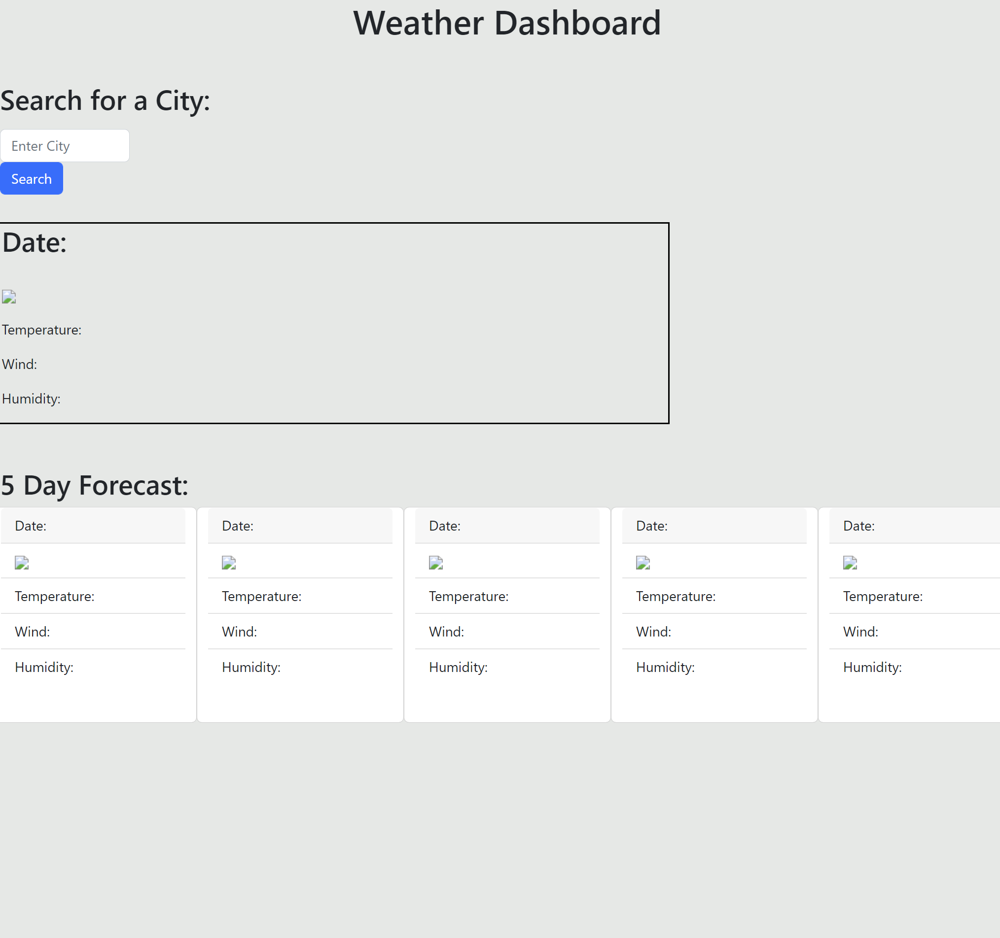

# Weather Dashboard

[Link to my Project https://elijahnance.github.io/weather-dashboard/](https://elijahnance.github.io/weather-dashboard/)

## Table of Contents
- [Description]
- [Visuals]

## Description
This application retrieves weather data from any city that the user wants. It uses 3 weather api's to pull the specefic coordinates of the city and then fetches the weather data of that city. The results come back with current weather for the city and a 5 day forecast. Previous searches also get saved to the page and can be clicked to load that cities weather information.

## Visuals
